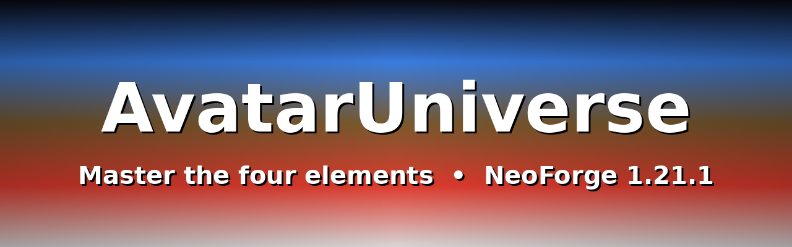

[](LICENSE)
[](https://minecraft.net)
[](https://neoforged.net)
[](https://adoptium.net)

# AvatarUniverse

AvatarUniverse by PhataBaniyan — a NeoForge 1.21.1 bending mod (ModDevGradle):
master the four elements, unlock their sub-arts over time, and bend with
abilities inspired by ProjectKorra.

## Contents

- [Playing](#playing)
- [Time mastery](#time-mastery)
- [Building](#building)
- [Project layout](#project-layout)
- [Mod details](#mod-details)
- [Screenshots](#screenshots)
- [Mapping names](#mapping-names)
- [Resources](#resources)

## Playing

- `/au choose <air|water|earth|fire>` — pick an element (no OP needed).
  `bind`, `help`, `display`, `toggle`, `clear` and the rest work for everyone;
  `add` and `reload` stay operator-only.

## Time mastery

Every 10 Minecraft days of attuned play unlocks the next sub-element of each
held base element automatically:

| Base    | Unlock order                              |
| ------- | ----------------------------------------- |
| Water   | Ice → Plant → Healing → Blood             |
| Earth   | Sand → Metal → Lava                       |
| Fire    | Lightning → Combustion → Blue Fire        |
| Air     | Spiritual → Flight                        |

Avatar is granted by operators only (`/au add`). Tune via
`general.masteryEnabled` / `masteryAttunementMs`.

## Building

```bash
./gradlew --refresh-dependencies   # refresh local cache
./gradlew clean build              # build, output in build/libs/avataruniverse-0.1.0.jar
./gradlew runClient                # test client (working dir: run/)
./gradlew runServer                # test server (--nogui)
./gradlew runData                  # datagen -> src/generated/resources/
./gradlew spotlessApply            # format code
./gradlew spotlessCheck            # CI formatting gate
```

Copy the built JAR from `build/libs/` into a NeoForge 1.21.1 `mods/` folder.
You need **JDK 21** (Temurin recommended) plus IntelliJ IDEA or Eclipse with
Gradle import.

## Project layout

- `src/main/java/com/phatabaniyan/avataruniverse/` — `AvatarUniverseMod`, `AvatarUniverseClient`, `Config`
- `src/main/resources/assets/avataruniverse/lang/en_us.json` — config translations
- `src/main/templates/META-INF/neoforge.mods.toml` — mod metadata (expanded by `generateModMetadata`)
- `src/generated/resources/` — datagen output (created by `runData`, git-ignored `.cache` only)

## Mod details

- Mod ID: `avataruniverse`
- Version: `0.1.0`
- License: LGPL-2.1-or-later (see `LICENSE`). Ability mechanics are inspired by
  ProjectKorra and related bending plugins — see `CREDITS.md`.
- Config: COMMON `avataruniverse-common.toml` (`enableDebugLogging`, default false) + in-game config screen.
- Config layout mirrors ProjectKorra's `config.yml`: `general` switches, then
  `abilities.<element>.<Ability>` sections, all times in **milliseconds**.
  (Keys were renamed from the old flat layout — delete an existing
  `avataruniverse-common.toml` once to regenerate it with defaults.)

## Screenshots

Gameplay shots go here — drop PNGs into `docs/` and reference them, e.g.:

```markdown

```

## Mapping names

By default, the MDK uses official Mojang mapping names, covered by a specific license. See https://github.com/NeoForged/NeoForm/blob/main/Mojang.md. Parchment mappings (`2024.11.17`, latest for 1.21.1) add parameter names/javadocs.

## Resources

Community Documentation: https://docs.neoforged.net/
NeoForged Discord: https://discord.neoforged.net/
